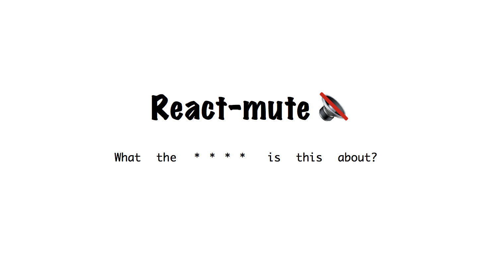

> Mute the bad words in react component

## Introduction

Stop people from polluting your react application with bad words. Mute the bad words.

## Installing

```sh
  $ yarn add react-mute
```

## Usage

```js
  import Mute from 'react-mute';

  // in render
  <Mute
    text="Actual text there bad words are to be muted"
    safeText="❤️"
    addWords=["bad"]
  >{(mutedText) => (
      <div>{mutedText}</div>
    )}
  </Mute>

  // => <div>Actual text there ❤️❤️❤️ words are to be muted</div>
```

## API

### **`children`**

Function which takes muted text and return valid react Node.

### **`addWords`**

Array of words to mute. These will append to the list of existing list of bad words. 

List of words &rarr; https://github.com/web-mech/badwords/blob/master/lib/lang.json

### **`removeWords`**

Array of words to unmute. This will remove words from existing list of bad words.

### **`safeText`** 

**default: '*'**

Replace these character in muted words.

### **`text`**

Text to make safe

*** This package is dependent on https://github.com/web-mech/badwords for badwords implementation ***
